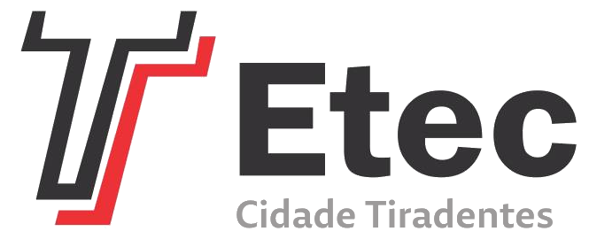

<h1 align=center>ETEC199-2023-QTS</h1>

<p align="center">
  
</p>

#
### SOBRE

- Diretório contendo desenvolvimento dos exercícios na disciplina de Qualidade e Testes de Software(WTS) na Etec Cidade Tiradentes em 2023.
- Possui pequenos projetos submetidos como proposta de solução, com o intuito de atender aos requisitos solicitados.

#
### CONTEUDO ABORDADO

- *Tipos de Teste*: Funcionalidade, Usabilidade, Performance e Seguranca;
- *Niveis de Teste*: Unitario, Integracao, Interface, Aceitacao e Regressao;
- *Tecnicas de Teste*: Funcional(Caixa Preta) e Estrutural(Caixa Branca).

#
### TECNOLOGIAS
&nbsp;
&nbsp;
&nbsp;

#
### CONTRIBUIÇÃO

```
$ git clone https://github.com/kaiquesouzasantos/etec199-2023-qts.git 
```
